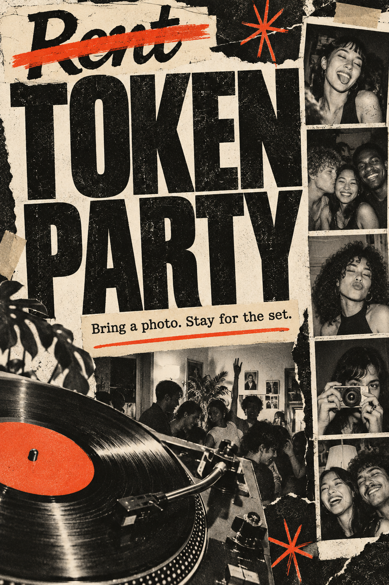

# ~~Rent~~ Token Party

Bring a photo. Stay for the set.

Token Party brings together experiments in DJ mixing and native photo editing, built during the September 10, 2026 hackathon with GPT-6 Astra. Each project keeps its own code, setup instructions, and build history.

| Project | What it does | Status |
| --- | --- | --- |
| [Back 2 Back](b2b/README.md) | A browser DJ mixer with audio analysis, manual controls, and phrase-aligned transitions. | Local playback and rule-based mixing verified; live Astra planning still needs runtime verification. |
| [Roundtrip](roundtrip/README.md) | A Lightroom workflow connecting photo feedback, native edits, exports, and gallery revisions. | Local editing demonstrated; see the build log for current remote-access and workflow limits. |
| [Design Tutor](design-tutor/README.md) | A proposed website-to-Figma reconstruction and teaching experience. | Idea generation only; no implementation. |

Start with each project's README for setup. Personal tracks, RAW photos, exports, credentials, and local caches are excluded from Git; provide your own media and local configuration.

Follow the [activity log](research/activity-log.md), [decisions](research/decisions.md), and [usage register](usage.md) for the project's history. Detailed implementation evidence lives in the [Back 2 Back build log](b2b/docs/build-log.md) and [Roundtrip build log](roundtrip/build-log.md). Research notes are dated snapshots and include proposals that were never implemented.

Project code licenses are in [Back 2 Back](b2b/LICENSE) and [Roundtrip](roundtrip/LICENSE); vendored dependencies retain their own notices.
