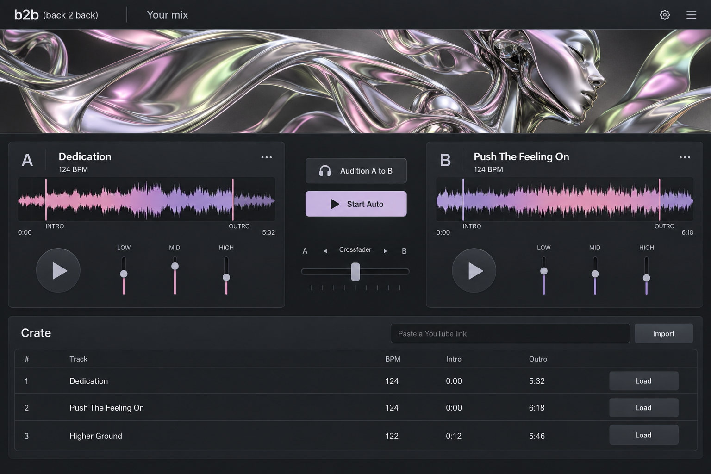
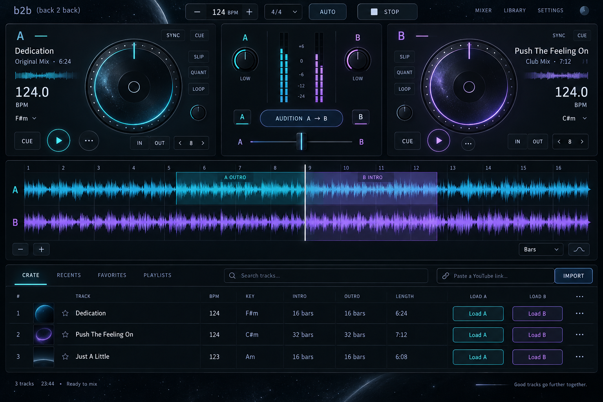

# b2b visual explorations

## Revision 2: chrome art, familiar controls

The second concept uses a separate sculptural chrome art strip, restrained charcoal controls, and pastel reflections. It was generated with the built-in ChatGPT Image tool in one generation on September 10, 2026, following the user's request to continue ChatGPT Image. No API key was required.



Preserve the real app's controls, phrase inspector and measured timing. The generated metadata, extra EQ controls and third track are illustrative. This is a visual concept, not a functional screenshot or a request to replace existing controls.

### Revision 2 prompt

```text
Use case: ui-mockup
Asset type: one high-fidelity desktop DJ application interface concept, landscape.
Primary request: Create a beautiful contemporary working DJ app called "b2b (back 2 back)". Keep the actual controls simple and usable. Put the expressive visual identity in a wide generative-art strip ABOVE the controller, visually separate from every interactive control.
Art direction: premium fashion and industrial sculpture. A flowing liquid-chrome synthetic form, with a subtly suggested sleek robotic profile dissolving into satin-metal ribbons. Sophisticated, sculptural, ambiguous, not a mascot. Soft pink, pale lime, lavender and silver reflections, luxurious smooth surfaces, softly lit graphite backdrop. The art should suggest music-reactive motion captured at one instant.
Composition: Full application screen, front-on, no monitor, no browser chrome. Small exact brand "b2b (back 2 back)" at top left; restrained heading "Your mix". Beneath the header a wide shallow artwork strip spanning the whole interface, roughly a fifth of the screen height. Below it, two ordinary clean deck panels A and B with track names "Dedication" and "Push The Feeling On", readable "124 BPM", short colored waveforms with labeled "INTRO" and "OUTRO", simple play buttons and low EQ sliders. Central compact crossfader and clearly legible "Audition A to B" and "Start Auto" buttons. NO giant turntables, orbital rings or decorative control instruments. Lower portion a useful "Crate" table with 3 rows, columns Track / BPM / Intro / Outro and load buttons. Include a modest field "Paste a YouTube link" with "Import" button.
Visual design: neutral charcoal and silver interface, matte panels, subtle boundaries, generous but practical spacing, exceptionally clear typography. Muted pink and lavender waveform accents. Contemporary editorial design, quietly confident. The application must look usable and the separate artwork must look extraordinary.
Text constraints: exact product name "b2b (back 2 back)". Use only useful functional labels. No slogans, no decorative footer, no eyebrow labels, no "LIVE SESSION", no "LIVE STUDY", no "RECORD BAG".
Avoid: early-2000s sci-fi, cyberpunk, space HUDs, neon, stars, planets, orbital rings, shiny decorative buttons, robot mascot embedded in controls, fantasy dashboards, excessive glassmorphism, marketing landing page, fake surveillance telemetry.
```

**Superseded:** the user rejected the orbital interface as too reminiscent of early-2000s sci-fi. The working interface now keeps neutral controls and places spectrum-reactive sculptural ribbons in a separate art strip (`web/visualizer.js`). The original concept below is retained only as decision history.

## Archived orbital concept

Generated on September 10, 2026 with the built-in ChatGPT Image tool, one generation. No API key was required. The image is a design reference; its sample track metadata and extra controls are illustrative, not measured or implemented behavior.



## Direction

- Midnight graphite panels, cyan deck A, lavender deck B, restrained edge lighting.
- Concentric platter rings anticipate the future Blender deck without obscuring waveform timing.
- Keep Audition prominent between the decks. Align phrase highlights with the bar grid and show both tracks against the same time axis.
- Retain accessible text and real controls in HTML; do not use the image as an interactive screen. Implement only controls backed by the audio engine.

## Generation prompt

```text
Use case: ui-mockup
Asset type: high-fidelity desktop DJ application interface concept, landscape screen.
Primary request: Design the working interface for "b2b (back 2 back)", a two-deck house DJ app. Space-y, sophisticated orbital instrument. A credible, shippable interface with beautiful tactile circular platter forms that could later become a Blender-built deck.
Scene/backdrop: nearly black midnight space background, faint star field and subtle distant atmosphere, restrained luminous cyan and lavender-violet signal colors.
Composition: full application screenshot, front-on, no browser frame, no physical monitor. Small exact product name "b2b (back 2 back)" top left. Transport strip across top with tempo "124 BPM", "4/4", "AUTO", "STOP". Main upper work area has Deck A left and Deck B right, each with one elegant circular platter, track title, large BPM readout, small controls; central mixer has two low-EQ knobs, channel levels, crossfader, and prominent "AUDITION A → B" button. A full-width precise wave/phrase inspector below: two stacked cyan and violet waveforms with numbered bar grid 1 through 16, highlighted intro/outro overlap and clear vertical playhead. Lower section shows a compact crate table with track name, BPM, key, intro, outro and load actions; compact field "Paste a YouTube link" and "IMPORT".
Track text: Deck A "Dedication"; Deck B "Push The Feeling On". Crate can show three clear rows, "Dedication", "Push The Feeling On", "Just A Little".
Typography: very legible contemporary sans-serif with compact monospaced numerals. Sharp labels, well-spaced controls, strong hierarchy. Enough negative space to operate without visual overload.
Materials: dark graphite and smoked glass panels with subtle depth, finely engraved tick marks, orbital rings, quiet edge lighting. Subtle physicality but flat front-on usable software UI.
Constraints: app interface only, not a website hero or promotional poster. No people, no astronauts, no spacecraft, no logos of other brands. Avoid enormous decorative globes, excessive glow, illegible microtext, generic dashboard cards, and extraneous fictional control panels. Every element should support mixing or inspecting audio. Exact brand text must be "b2b (back 2 back)".
```
